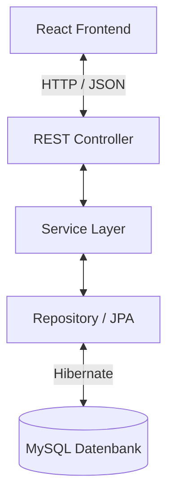

# CookShare

**CookShare** ist eine Full-Stack-Webanwendung zum **Entdecken und Verwalten von Rezepten**.  
Benutzer können Rezepte erstellen und durchsuchen.  
Das Projekt dient als Lern-Projekt, um Webentwicklung mit **Spring Boot und React** umzusetzen.

---

# Tech Stack

## Backend
- Java 21
- Spring Boot
- Maven
- REST API
- Spring Data JPA / Hibernate
- MySQL 
- H2-Datenbank für Tests

## Frontend
- React
- Bootstrap
- JavaScript

## Weitere Tools
- Git / GitHub
- AI-Unterstützung für einzelne Komponenten
- Frontend wurde mit Antigravity entwickelt,  
  um den Fokus auf Backend-Architektur und API-Design zu legen.
---

# Voraussetzungen

Um das Projekt lokal auszuführen wird folgendes benötigt:
- **Java 21**
- **Maven 3.9+**
- **Node.js 18+**
- **npm**
- **Git**
- **MySQL**

---

# Setup – Projekt lokal starten

## 1. Repository klonen
```bash
git clone https://github.com/USERNAME/cookshare.git
cd cookshare
```

## 2. Datenbank (MySql) einrichten:
Erstelle eine MySQL-Datenbank mit dem Namen `cookshare`.

Verbindung:
```bash
spring.datasource.url=jdbc:mysql://localhost:3306/cookshare
```

## 3. Umgebungsvariablen setzen
Folgende Umgebungsvariablen müssen gesetzt werden:
```bash
app.jwtSecret=${JWT_SECRET:?JWT_SECRET fehlt}
spring.mail.username=${MAIL_USER:?MAIL_USER fehlt}
spring.mail.password=${MAIL_APP_PASS:?MAIL_APP_PASS fehlt}
spring.datasource.username=${DB_USER:?DB_USER fehlt}
spring.datasource.password=${DB_PASS:?DB_PASS fehlt}
```
Dafür wird ein JWT Secret und ein Mail-Account benötigt.

## 4. Backend starten
```bash
cd backend
mvn spring-boot:run
```
Das Backend läuft auf:
http://localhost:8080

## 5. Frontend starten
```bash
cd frontend
npm install
npm start
```

Das Frontend läuft auf:
http://localhost:3000

# Architektur
Die WebApp besteht aus 3-Schichten:
- **Frontend (React):** Benutzeroberfläche, kommuniziert über HTTP/JSON mit dem Backend
- **Backend (Spring Boot):** REST Controller → Service Layer → Repository
- **Datenbank (MySQL):** Persistenz über JPA/Hibernate, H2 für Tests



# Projektstatus
Das Projekt befindet sich aktuell noch in Entwicklung.

### Fertig
- Backend-Architektur mit Entity‑Service‑Repository‑Schichten
- CRUD für User 
- DTOs inklusive Validierung und DTO‑Mapping
    - User
    - Recipes
- Sicherheit 
- Grundlegende Frontend‑Struktur
<<<<<<< HEAD
=======
Mock‑Logik in Contexts implementiert (Rezepte, Auth).
>>>>>>> 17be25a2bffca61f8eaec0ff78a0c2692987e4c5
- Repository‑Tests für User
- Benutzerregistrierung & Login (JWT)
- Logout
- REST API Grundstruktur

### Geplant
- Backend
    - RecipeController vervollständigen
    - RecipeService verfollständigen
    - DTO‑Validierung auf allen neuen Routen prüfen.
    - Security‑Regeln für Rezepte (Autor‑Checks, öffentliche Rezepte).
    - Weitere Services implementieren
        - Bild‑Upload
        - Likes
        - Kommentare
    - CORS‑Konfiguration, globale Exception‑Handler.
    - Blacklist für JWT (ausgellogte User)
    - Unit‑ und Integrationstests für Rezepte (Controller/Service).
    - Funktion des Refreshtoken

- Frontend
    - Fetch‑API einbauen:
        - Requests an Backend‑Routen für Login, Register, User‑Daten, Rezepte.
    - State‑Management:
        - Loading‑ und Error‑Zustände.
        - Umgang mit JWT‑Token (Speichern in localStorage).
    - Verknüpfung von UI‑Aktionen (Likes, Delete, Follow) mit API‑Calls.
    - Validierung im Frontend (react-hook-form).
    - UI‑Polish: Responsiveness, Fehlermeldungen.

- Allgemein
    - Deployment‑Vorbereitung (Docker)

## Tests ausführen
**Backend:**
```bash
cd backend
mvn test
```

# Ziel des Projekts
Dieses Projekt wurde entwickelt, um praktische Erfahrungen mit folgenden Themen zu sammeln:
- Entwicklung von REST APIs mit Spring Boot
- Full-Stack Entwicklung mit React
- Strukturierung größerer Softwareprojekte
- Zusammenarbeit von Backend und Frontend
- Nutzung von Git und GitHub für Versionskontrolle